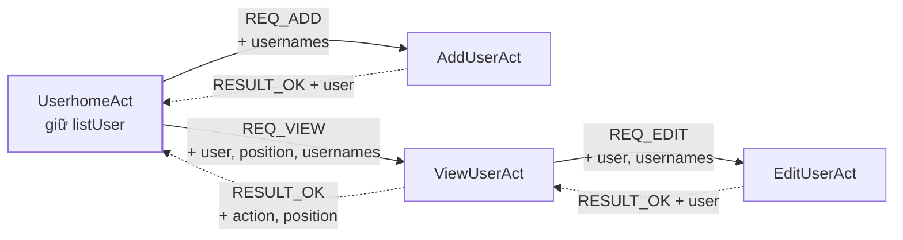
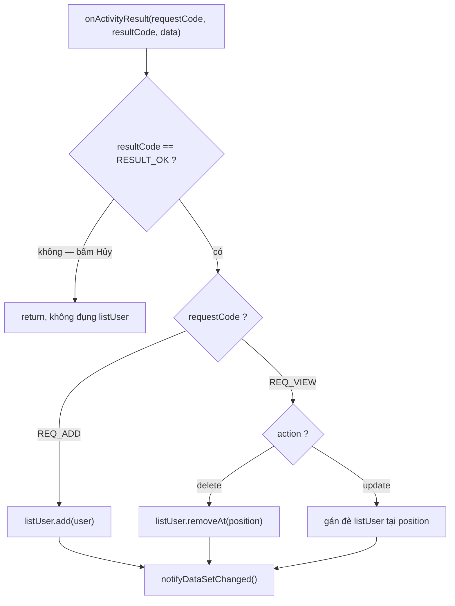
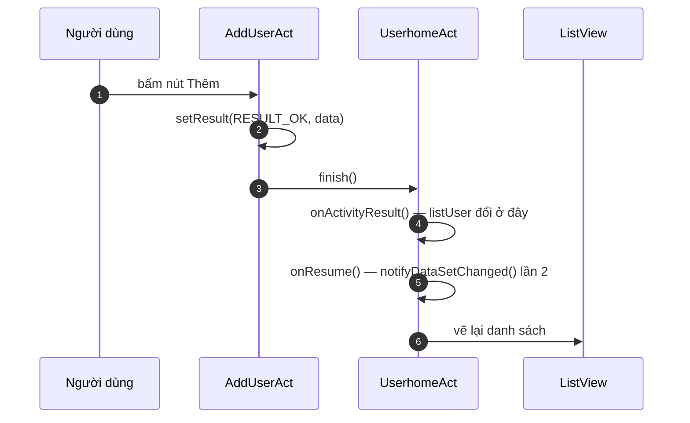
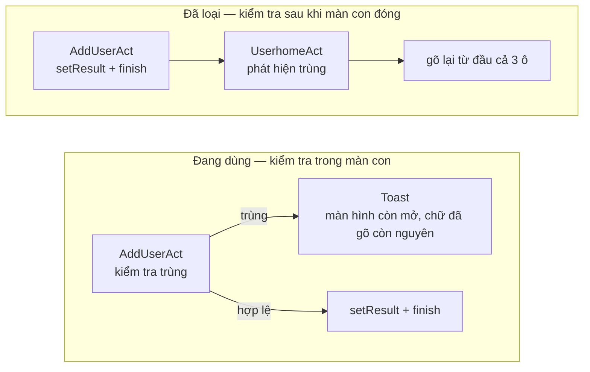

# Luồng dữ liệu giữa bốn màn hình — bai03

> Mở bằng VS Code (Ctrl/Cmd + Shift + V) hoặc xem trên GitHub để thấy biểu đồ.

## 1 · Mở màn con, nhận kết quả về

Nét liền = đi ra. Nét đứt = trả về. Chỉ `UserhomeAct` sửa `listUser`.



`EditUserAct` không trả thẳng về `UserhomeAct` — nó trả cho `ViewUserAct`, rồi màn này mới gói
lại thành `action="update"` gửi tiếp.

## 2 · onActivityResult rẽ nhánh thế nào

Hai cửa ải thoát sớm, rồi mới tới chỗ sửa dữ liệu.



Sửa `listUser` mà quên `notifyDataSetChanged()` thì màn hình không đổi gì cả, và không có báo lỗi nào.

## 3 · Thứ tự chạy khi màn con đóng

`onActivityResult` chạy **trước** `onResume` — nên lệnh làm mới trong `onResume` là thừa.



## 4 · Chặn trùng tên: đặt phép kiểm tra ở đâu

Cùng một điều kiện `if`, đặt sớm hay muộn khác hẳn nhau.



Bẫy ở màn Sửa — giữ nguyên tên của chính mình là hợp lệ:

```kotlin
if (!edited.username.equals(user.username, ignoreCase = true) &&
    usernames.any { it.equals(edited.username, ignoreCase = true) }
) {
    // chỉ chặn khi đổi sang tên của NGƯỜI KHÁC
    Toast.makeText(this, "Username đã tồn tại", Toast.LENGTH_SHORT).show()
    return
}
```

## Ba quy tắc

- **Một chủ sở hữu dữ liệu** — màn con đề nghị bằng cách trả kết quả, không tự sửa `listUser`.
- **requestCode để nhận diện** — một màn mở nhiều loại màn con, đây là thứ duy nhất phân biệt được.
- **Kiểm tra nơi người dùng còn sửa được** — báo lỗi lúc màn hình đã đóng là bắt gõ lại từ đầu.

---

Mô tả đúng code bai03 tại commit `ed01c71`.
