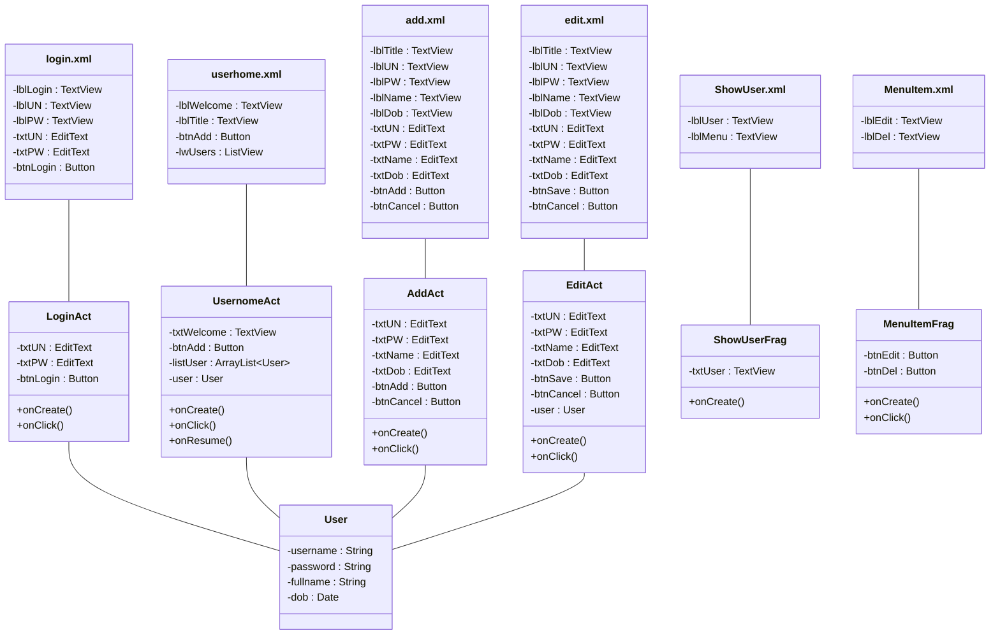
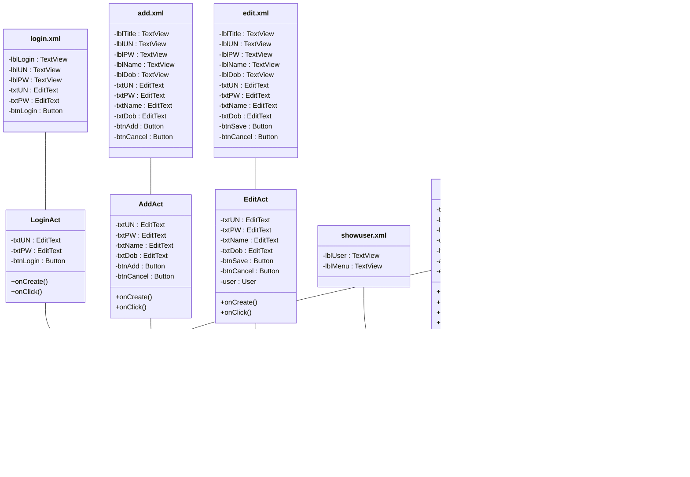

# Bài 4 — UML slide 7 và đối chiếu với code

## 1. UML trong slide (chép nguyên văn)

## 2. Code bài 4 đang có

## 3. Bảng đối chiếu

| UML slide 7 | Code bài 4 | Khớp |
|---|---|---|
| login.xml (6 view) | y hệt | ✅ |
| userhome.xml (4 view) | y hệt | ✅ |
| add.xml (11 view) | y hệt | ✅ |
| edit.xml (11 view) | y hệt | ✅ |
| ShowUser.xml: lblUser, lblMenu | đủ 2 id, tên file viết thường | ⚠️ aapt2 bắt buộc tên file tài nguyên viết thường |
| MenuItem.xml: lblEdit, lblDel : TextView | đủ 2 id; phần tử khai báo là `<Button>` | ⚠️ Button kế thừa TextView nên vẫn đúng kiểu; phải là Button để khớp ô MenuItemFrag |
| LoginAct (3 biến, 2 hàm) | y hệt | ✅ |
| UsernomeAct: txtWelcome, btnAdd, listUser, user, onCreate, onClick, onResume | UserhomeAct, đủ cả 7 | ⚠️ tên lớp trong slide gõ nhầm (userhome.xml lại viết đúng) |
| AddAct (6 biến, 2 hàm) | y hệt | ✅ |
| EditAct (7 biến, 2 hàm) | y hệt | ✅ |
| ShowUserFrag: txtUser | có | ✅ |
| ShowUserFrag: onCreate() | init + bind() + setOnMenuClickListener(); thêm lblMenu | ❌ lớp View không có onCreate() |
| MenuItemFrag: btnEdit, btnDel, onClick() | y hệt | ✅ |
| MenuItemFrag: onCreate() | init + showAt(); thêm popup, onEdit, onDelete | ❌ lớp View không có onCreate() |
| User: username, password, fullname, dob : Date | y hệt (Date không nullable) | ✅ |
| — | UserhomeAct thêm lwUsers, adapter, editingPosition, onActivityResult | ➕ bắt buộc để ListView và startActivityForResult chạy được |

## 4. Kết luận

Đã khớp UML. Những chỗ còn lại không sửa được vì bản thân slide mâu thuẫn hoặc Android không cho phép:

1. **Tên file tài nguyên** — `ShowUser.xml`, `MenuItem.xml` phải viết thường (`showuser.xml`, `menuitem.xml`), aapt2 từ chối chữ hoa.
2. **`UsernomeAct`** — slide gõ nhầm chữ `h` thành `n`; code giữ `UserhomeAct` cho khớp `userhome.xml`.
3. **`onCreate()` trong ShowUserFrag / MenuItemFrag** — hai lớp này kế thừa `View`, không phải `Activity`, nên không có `onCreate()`; phần khởi tạo nằm trong khối `init`.
4. **`MenuItem.xml` : TextView vs `MenuItemFrag` : Button** — slide tự mâu thuẫn. Code khai báo `<Button android:id="@+id/lblEdit">`: id đúng theo ô MenuItem.xml, kiểu Button đúng theo ô MenuItemFrag, và Button vốn kế thừa TextView nên cả hai ô đều đúng.
5. **`lwUsers`, `adapter`, `editingPosition`, `onActivityResult`** — UML thiếu, nhưng thiếu chúng thì ListView không có dữ liệu và không nhận được kết quả trả về từ màn Thêm/Sửa.

Kiểm tra chặn trùng username chuyển về `UserhomeAct.onActivityResult` (nơi đã sẵn có `listUser`), nên `AddAct` và `EditAct` không phải mang thêm biến ngoài UML.

`UserFormView` và `view_user_form.xml` đã xóa; 4 ô nhập nằm thẳng trong `add.xml` / `edit.xml` đúng như UML.
